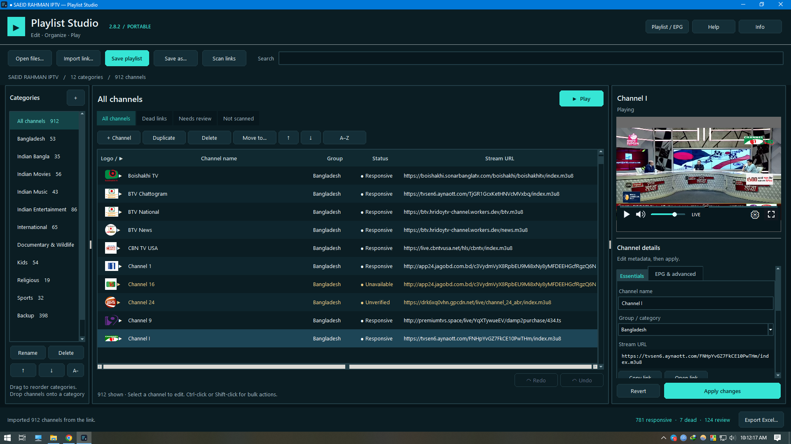

<!-- BDIX-IPTV Banner -->

  

# 📺 Saeid Rahman — BDIX IPTV Playlist

A curated IPTV playlist focused on **Bangladeshi channels, Indian channels, and selected international content** — organized for clean browsing, reliable streams, accurate metadata, and useful backups.

## 📂 Playlist

**[▶️ Open Main M3U Playlist](https://raw.githubusercontent.com/saeidrahmanbd/BDIX-IPTV/main/IPTV-Playlist.m3u)**

Compatible with **XCIPTV** and other M3U-compatible players.

## 📥 Download Center

Everything visitors commonly need, in one place:

- 📺 **[Main M3U Playlist](https://raw.githubusercontent.com/saeidrahmanbd/BDIX-IPTV/main/IPTV-Playlist.m3u)**
- 🖥️ **[Playlist Studio](https://github.com/saeidrahmanbd/BDIX-IPTV/releases/latest)** — latest Windows release
- 🛜 **[Xtream Codes](xtream/README.md)** — Xtream Gateway / XCIPTV
- 📡 **[EPG Documentation](epg/README.md)** — EPG sources and configuration
- ⚙️ **[Sample Configuration](examples/sample-config.md)**
- 📚 **[Documentation](docs/README.md)**
- 📝 **[Changelog](docs/CHANGELOG.md)**

**[→ Open the full Download Center](docs/DOWNLOADS.md)**

## 🖥️ Playlist Studio

A portable Windows companion for browsing, searching, checking, and managing IPTV playlists.

- **[Download latest release](https://github.com/saeidrahmanbd/BDIX-IPTV/releases/latest)**
- **[View all releases](https://github.com/saeidrahmanbd/BDIX-IPTV/releases)**

## 📊 Project Status

The project is maintained as a curated playlist and supporting documentation:

| Area | Status |
|---|---|
| 📺 Playlist | Curated & updated |
| 🖼️ Logos | Local repository logos |
| 📡 Streams | Curated and reviewed |
| 📄 EPG | Configuration maintained |
| 🧹 Metadata | Curated |
| 📝 Changelog | Maintained |

## 🗂️ Organization

- 🇧🇩 Bangladesh
- 🇮🇳 India — grouped by language/region
- 🎬 Movies
- 🎵 Music
- 📰 News
- ⚽ Sports
- 🧒 Kids
- 🌿 Documentary & Wildlife
- ☪️ Religious
- 🌍 Selected International
- 🔁 Backup Streams

The playlist prioritizes **clean channel identity, consistent metadata, local logos, and practical backup streams** over simply collecting more entries.

## 🔧 Maintenance

Automated maintenance focuses only on:

- EPG mapping and coverage expansion
- Channel name, ID, number, and metadata normalization
- Logo audit, missing-logo recovery, local logo storage, and logo metadata repair
- Playlist audit and project dashboard generation

Stream health is intentionally **not automated**; stream availability is reviewed manually.

Primary curated entries are protected from indiscriminate changes.

**[→ Changelog](docs/CHANGELOG.md) · [→ Documentation](docs/README.md)**

## 📬 Support

Found a broken stream, incorrect information, missing logo, or another issue?

- 🐞 **[Report an issue](https://github.com/saeidrahmanbd/BDIX-IPTV/issues)**
- 💬 **[Join Discussions](https://github.com/saeidrahmanbd/BDIX-IPTV/discussions)**
- 👤 **[Saeid Rahman](https://github.com/saeidrahmanbd)**

For stream reports, include the **channel name, stream/playlist URL, and a short description** when possible.

## ⚠️ Disclaimer

This repository does not host television channels or video content. It contains references to publicly available streams. Availability and programme information may change without notice.

Users are responsible for complying with applicable laws, regulations, and service terms.

---

⭐ If you find the project useful, consider starring the repository.

**Repository:** https://github.com/saeidrahmanbd/BDIX-IPTV
