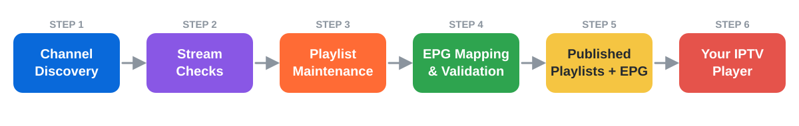

# BDIX-IPTV — Bangladesh IPTV M3U/M3U8 Playlists & XMLTV EPG

<div align="center">


<a href="https://saeidrahmanbd.github.io/BDIX-IPTV/">
  
</a>

<br>

### 📺 &nbsp;**A free, curated Bangladesh IPTV playlist project featuring Bangla TV, Indian, Pakistani and eligible international channels.**

**Get M3U/M3U8 playlist URLs, organized channel groups, locally stored logos, alternate streams and a shared XMLTV Electronic Programme Guide (EPG).**

<sub>For compatible IPTV applications including XCIPTV, TiviMate, OTT Navigator, IPTV Smarters, VLC, Kodi and other M3U players.</sub>

<br>

<a href="https://raw.githubusercontent.com/saeidrahmanbd/BDIX-IPTV/main/IPTV-Playlist.m3u"></a>
<a href="https://raw.githubusercontent.com/saeidrahmanbd/BDIX-IPTV/main/International-Playlist.m3u"></a>
<a href="https://raw.githubusercontent.com/saeidrahmanbd/BDIX-IPTV/main/epg/epg.xml"></a>

<a href="https://saeidrahmanbd.github.io/BDIX-IPTV/"></a>
<a href="https://saeidrahmanbd.github.io/BDIX-IPTV/playlists.html"></a>
<a href="https://saeidrahmanbd.github.io/BDIX-IPTV/bangla-iptv.html"></a>

<br><br>

<a href="https://github.com/saeidrahmanbd/BDIX-IPTV/stargazers"></a>
<a href="https://github.com/saeidrahmanbd/BDIX-IPTV/network/members"></a>
<a href="https://github.com/saeidrahmanbd/BDIX-IPTV/commits/main"></a>
<a href="LICENSE"></a>
<a href="https://github.com/saeidrahmanbd/BDIX-IPTV/actions"></a>

<a href="https://github.com/saeidrahmanbd/BDIX-IPTV/issues"></a>
<a href="https://github.com/saeidrahmanbd/BDIX-IPTV/discussions"></a>

<a href="https://saeidrahmanbd.github.io/BDIX-IPTV/"></a>

<br>

<a href="#quick-start">🚀 Quick Start</a> &nbsp;•&nbsp;
<a href="#playlists">📡 Playlists</a> &nbsp;•&nbsp;
<a href="#players">📱 Players</a> &nbsp;•&nbsp;
<a href="#epg">🗓️ EPG</a> &nbsp;•&nbsp;
<a href="#reports">📊 Reports</a> &nbsp;•&nbsp;
<a href="#maintenance">⚙️ Maintenance</a> &nbsp;•&nbsp;
<a href="#studio">🖥️ Playlist Studio</a> &nbsp;•&nbsp;
<a href="#faq">❓ FAQ</a>

</div>

---

<a id="quick-start"></a>

## 🚀 Quick Start — Add IPTV in 3 Steps

| Step | What to do |
|:---:|---|
| **① 📋** | **Copy a playlist URL** from the [playlist choices](#playlists) below. |
| **② ➕** | **Add it to your IPTV player:** choose *Add Playlist by URL* (wording varies by app), then paste the URL. |
| **③ 🗓️** | **Configure the TV guide:** add the [XMLTV EPG URL](#epg) in your player's EPG settings and refresh the guide. |

> [!TIP]
> **New here?** Start with the [step-by-step playlist guide](https://saeidrahmanbd.github.io/BDIX-IPTV/playlists.html). বাংলা নির্দেশনার জন্য [বাংলা IPTV গাইড](https://saeidrahmanbd.github.io/BDIX-IPTV/bangla-iptv.html) দেখুন।

<a id="toc"></a>

## 🧭 Table of Contents

| | Section | | Section |
|:---:|---|:---:|---|
| ℹ️ | [About the Project](#about) | 🔧 | [How Playlist Maintenance Works](#maintenance) |
| 📡 | [Choose Your IPTV Playlist](#playlists) | 🖥️ | [Playlist Studio for Windows](#studio) |
| 📱 | [Compatible IPTV Players](#players) | ❓ | [Frequently Asked Questions](#faq) |
| 🗓️ | [XMLTV EPG and TV Guide Setup](#epg) | 💬 | [Support and Contact](#support) |
| 📊 | [Channel Information and Project Reports](#reports) | ⚖️ | [License and Disclaimer](#license) |

---

<a id="about"></a>

## ℹ️ About BDIX-IPTV

**BDIX-IPTV** is a public, curated IPTV playlist project focused on Bangladesh and multi-country television channel collections. It provides remote **M3U and M3U8 playlist URLs** for compatible players, with channel groups, metadata, locally stored logo assets where available, alternate stream entries and a shared **XMLTV Electronic Programme Guide**.

The repository maintains two playlist collections:

| 📁 Playlist | 📝 Description |
|---|---|
| 🟦 **IPTV-Playlist.m3u** | The main multi-country collection covering Bangladesh, India, Pakistan and eligible channels from other countries, arranged in country and genre groups. |
| 🟪 **International-Playlist.m3u** | A companion collection that includes Bangladesh and India alongside eligible channels from other countries. |

Automated and owner-reviewed maintenance processes support channel discovery, playlist checks, metadata and logo maintenance, backup handling, EPG mapping and publication validation. The project publishes status and audit reports so visitors can inspect the available evidence rather than relying on unverified channel-count or uptime claims.

### ✨ Project Features

| | Feature | What it provides |
|:---:|---|---|
| 🌍 | **Multi-country M3U/M3U8 playlists** | Main and International playlist collections |
| 🇧🇩 | **Bangla TV** | Bangladesh-focused channel selection |
| 🗂️ | **Country and genre groups** | Organized browsing in compatible players |
| 🖼️ | **Local channel logos** | Repository-hosted logo assets where available |
| 🔁 | **Alternate streams and backups** | Additional stream options where maintained |
| 🗓️ | **XMLTV EPG** | Shared programme guide for compatible players |
| 🩺 | **Playlist and stream checks** | Automated diagnostics with published reports |
| 🔎 | **Channel discovery** | Review and maintenance of potential additions |

> [!NOTE]
> **Availability note:** IPTV streams and programme schedules can change, become restricted or stop working without notice. A channel listing does not guarantee that its stream is currently reachable or that EPG data is available.

---

<a id="playlists"></a>

## 📡 Choose Your IPTV Playlist

### 🟦 1. Main Multi-Country IPTV Playlist

The main collection includes Bangladesh, India, Pakistan and eligible channels from other countries, organized into country and genre groups.

**🔗 Direct M3U URL**
```text
https://raw.githubusercontent.com/saeidrahmanbd/BDIX-IPTV/main/IPTV-Playlist.m3u
```

- 📥 [Open or download IPTV-Playlist.m3u](https://raw.githubusercontent.com/saeidrahmanbd/BDIX-IPTV/main/IPTV-Playlist.m3u)
- 🔍 [View the playlist source on GitHub](https://github.com/saeidrahmanbd/BDIX-IPTV/blob/main/IPTV-Playlist.m3u)

### 🟪 2. International IPTV Playlist

The companion collection includes Bangladesh and India, as well as eligible movie, music and other permitted channel selections from additional countries.

**🔗 Direct M3U URL**
```text
https://raw.githubusercontent.com/saeidrahmanbd/BDIX-IPTV/main/International-Playlist.m3u
```

- 📥 [Open or download International-Playlist.m3u](https://raw.githubusercontent.com/saeidrahmanbd/BDIX-IPTV/main/International-Playlist.m3u)
- 🔍 [View the playlist source on GitHub](https://github.com/saeidrahmanbd/BDIX-IPTV/blob/main/International-Playlist.m3u)

### 🤔 Which playlist should I choose?

| If you want… | Choose |
|---|---|
| 🟦 The main organized multi-country collection | **IPTV-Playlist.m3u** |
| 🟪 The separate companion international collection | **International-Playlist.m3u** |
| 📖 A visual guide to playlist setup | [Playlist Guide](https://saeidrahmanbd.github.io/BDIX-IPTV/playlists.html) |
| 🇧🇩 Instructions in Bangla | [বাংলা IPTV গাইড](https://saeidrahmanbd.github.io/BDIX-IPTV/bangla-iptv.html) |

---

<a id="players"></a>

## 📱 Compatible IPTV Players

The playlists use the widely supported M3U/M3U8 format and can be added to IPTV applications that accept remote playlist URLs.

Examples include:

<div align="center">


</div>

<br>

> [!TIP]
> **General setup:** Open your player, select *Add Playlist* or *Add Playlist by URL*, paste one of the playlist URLs above, save and refresh the channel list. The exact menu names depend on the application and device.

The project does not provide, endorse or require a particular third-party IPTV player.

---

<a id="epg"></a>

## 🗓️ XMLTV EPG – TV Programme Guide

Both playlists use the shared XMLTV Electronic Programme Guide (EPG), where supported channel IDs and programme schedules are available.

**🔗 Public XMLTV URL**
```text
https://raw.githubusercontent.com/saeidrahmanbd/BDIX-IPTV/main/epg/epg.xml
```

### 🛠️ How to add the EPG

| Step | Action |
|:---:|---|
| **1️⃣** | Open your IPTV player's EPG or TV Guide settings. |
| **2️⃣** | Choose the option to add an external XMLTV source or EPG URL. |
| **3️⃣** | Paste the URL above. |
| **4️⃣** | Save the source and refresh or update the EPG. |
| **5️⃣** | If programme information is missing, check that the channel's `tvg-id` matches an ID in the XMLTV guide. |

### 📈 Understanding EPG coverage

EPG availability is not identical for every channel. A channel can appear in a playlist without having current programme data. Coverage depends on source availability, channel-ID matching and the schedule window supplied by programme-guide providers.

- 📊 [Latest EPG coverage and mapping report](reports/epg-coverage.md)
- 📚 [Public EPG documentation](epg/README.md)
- 📂 [EPG source and mapping files](epg/)

> [!IMPORTANT]
> **Troubleshooting:** If a guide is empty, refresh the EPG, verify the XMLTV URL, check the channel's `tvg-id`, and consult the latest coverage report. Some channels may not have a matching schedule source.

---

<a id="reports"></a>

## 📊 Channel Information and Project Reports

We publish audit and diagnostic reports to make playlist maintenance more transparent. Reports are generated at different times and describe the specific data and checks recorded in each report.

| | Report | What it helps you understand |
|:---:|---|---|
| 📋 | [IPTV Playlist Audit](reports/iptv-playlist-audit.md) | Channel identity, metadata, duplicate and logo-related checks |
| 🩺 | [Stream Health Report](reports/stream-health.md) | Results and limitations of stream probes |
| 🗓️ | [EPG Coverage Report](reports/epg-coverage.md) | EPG channel mapping and programme coverage |
| 🔎 | [Channel Discovery Report](reports/iptv-channel-discovery.md) | Discovery activity and candidate channel information |
| 🔁 | [Backup Independence Audit](reports/backup-independence-audit.md) | Backup stream and identity review |
| ⚠️ | [Stream Risk Review](reports/stream-risk-review.md) | Stream risk and review findings |

> [!NOTE]
> **Please check each report's generated timestamp.** A report is a snapshot of its stated inputs and test environment, not a guarantee of future stream availability.

---

<a id="maintenance"></a>

## ⚙️ How Playlist Maintenance Works

The repository uses scripts and GitHub Actions to support repeatable maintenance. Depending on the workflow, processes may include:

<div align="center">



</div>

| Stage | Process |
|:---:|---|
| **🔍 1** | **Discovery:** identify potential channels and candidate stream references for review. |
| **🏷️ 2** | **Identity and metadata checks:** examine channel names, group assignments, identifiers and duplicate identities. |
| **🩺 3** | **Stream diagnostics:** probe stream endpoints and record the outcome and limitations of each check. |
| **🖼️ 4** | **Logo maintenance:** use locally stored assets and review logo matches where evidence is available. |
| **🗓️ 5** | **EPG mapping and validation:** associate channel IDs with XMLTV schedules and validate generated guide data. |
| **🚀 6** | **Publication:** publish playlist or guide changes after the applicable workflow checks and validation steps. |

> [!WARNING]
> A successful probe does not guarantee that a stream will remain available in every player, network or region. A failed probe may also reflect temporary restrictions, timeouts or the test environment rather than permanent stream failure. See the [stream health report](reports/stream-health.md) for the recorded context.

### 🤝 Automation and contribution resources

- ⚡ [GitHub Actions workflows](https://github.com/saeidrahmanbd/BDIX-IPTV/actions)
- 🧑‍💻 [Contributing guide](docs/CONTRIBUTING.md)
- 🔐 [Repository security policy](docs/SECURITY.md)
- 📚 [Project documentation index](docs/README.md)

---

<a id="studio"></a>

## 🖥️ Playlist Studio 5.1 for Windows

**Playlist Studio** is a separate Windows application maintained by the project owner for managing, editing, checking and playing M3U/M3U8 playlists.

It brings playlist editing, XMLTV EPG tools, stream diagnostics and provider playlist import into one desktop workspace.

<div align="center">

<a href="https://github.com/saeidrahmanbd/BDIX-IPTV/releases/tag/v5.1">
  
</a>

</div>

### 🌟 Playlist Studio 5.1 highlights

| | Feature | Details |
|:---:|---|---|
| 📝 | **M3U/M3U8 editor** | Organize channels, categories and metadata. |
| 🗓️ | **XMLTV EPG Centre** | Load guides from URLs and local XML, GZ, XZ and ZIP files; inspect guide coverage and Now/Next information. |
| ✏️ | **EPG editing** | Search and edit `tvg-id` values, preview bulk metadata edits and retain manual corrections. |
| 🩺 | **Stream scanner** | Review Responsive, Dead, Unreachable, Restricted, Stale, Unavailable, Unverified and Error outcomes. Timeouts and blocked requests are not automatically labelled Dead. |
| 🎛️ | **Scan controls** | Pause, resume and cancel scans; configure limits, timeouts and retries. |
| 🔌 | **Xtream Codes and Stalker/MAC** | Import supported provider playlists, with background operations and safer credential handling. |
| 🛡️ | **Safer editing** | Preserve playlist directives and unknown header keys, with backup and recovery features. |

### ⬇️ Download Playlist Studio 5.1

<div align="center">

<a href="https://github.com/saeidrahmanbd/BDIX-IPTV/releases/download/v5.1/Playlist-Studio-5.1.exe"></a>
<a href="https://github.com/saeidrahmanbd/BDIX-IPTV/releases/tag/v5.1"></a>

</div>

<br>

| | Requirement | Details |
|:---:|---|---|
| 🪟 | Operating system | Windows 10 / 11 |
| 🧱 | Architecture | 64-bit (x64) |
| 📦 | Edition | Portable executable; no traditional installation |
| 🎞️ | Playlist formats | M3U / M3U8 |
| 🗓️ | EPG formats | XMLTV from URLs and supported local files |
| ▶️ | Playback | Built-in player with bundled VLC engine |

The v5.1 release also includes a Windows Build Kit for users who want to build the application themselves. See the [build instructions](docs/PLAYLIST-STUDIO.md) and [release integrity record](docs/PLAYLIST-STUDIO-INTEGRITY.md).

> [!CAUTION]
> **Windows SmartScreen:** The published executable is unsigned and Windows may display a warning. Download it only from the official project release and review the release information before deciding whether to run it.

For the separate product repository, documentation and future releases, visit [Playlist Studio on GitHub](https://github.com/saeidrahmanbd/Playlist-Studio).

---

<a id="faq"></a>

## ❓ Frequently Asked Questions

<details>
<summary>💸 <strong>Is BDIX-IPTV free to use?</strong></summary>

<br>

The playlist files and project information are publicly accessible in this repository. Third-party IPTV applications, internet access and any external services you use may have their own costs or terms.
</details>

<details>
<summary>🏗️ <strong>Does BDIX-IPTV host TV channels or video streams?</strong></summary>

<br>

No. This repository provides playlist references and related metadata. It does not host television broadcasts, video content or broadcaster infrastructure.
</details>

<details>
<summary>📴 <strong>Why is a channel listed but not playing?</strong></summary>

<br>

Stream endpoints can change, become restricted or go offline. Check the latest stream health report and try again later. A probe result is a time-specific diagnostic, not a permanent availability guarantee.
</details>

<details>
<summary>🗓️ <strong>Why is the TV programme guide empty for some channels?</strong></summary>

<br>

Not every playlist channel has a matching XMLTV programme source. Check the channel's `tvg-id`, refresh your EPG and consult the latest [EPG coverage report](reports/epg-coverage.md).
</details>

<details>
<summary>📱 <strong>Can I use these playlists in TiviMate, XCIPTV, VLC or Kodi?</strong></summary>

<br>

Yes, these applications support M3U playlists or remote playlist URLs. The exact setup process varies by application and device.
</details>

<details>
<summary>🐞 <strong>How do I report a broken stream or incorrect channel information?</strong></summary>

<br>

Open a [GitHub Issue](https://github.com/saeidrahmanbd/BDIX-IPTV/issues). Include the channel name, playlist name, relevant stream URL, player or device, and a short description. Do not publish private provider credentials or tokens.
</details>

<details>
<summary>🤝 <strong>Can I contribute improvements?</strong></summary>

<br>

Yes. Read the [contributing guide](docs/CONTRIBUTING.md) and open an issue or discussion before proposing changes that affect playlist policies or maintenance.
</details>

---

<a id="support"></a>

## 💬 Support and Contact

Found a broken stream, incorrect channel information, missing logo or EPG mapping issue? Please open an issue with enough detail to reproduce or investigate the problem.

<div align="center">

<a href="https://github.com/saeidrahmanbd/BDIX-IPTV/issues"></a>
<a href="https://github.com/saeidrahmanbd/BDIX-IPTV/discussions"></a>

<br><br>

**👤 Project maintainer: Saeid Rahman**

<a href="mailto:saeidrahman.mkt@gmail.com"></a>
<a href="https://github.com/saeidrahmanbd"></a>
<a href="https://www.facebook.com/saeid.rahman.sr"></a>

</div>

---

<a id="license"></a>

## ⚖️ License and Disclaimer

The repository's original code and documentation are licensed under the [MIT License](LICENSE), to the extent owned by the maintainer.

The MIT License does **not** grant rights to third-party broadcaster names, channel logos, trademarks, programme information, stream endpoints, artwork or other third-party materials. Those materials remain subject to their respective owners' rights and applicable terms. A logo stored locally in this repository is not thereby verified as official or relicensed under MIT.

> [!IMPORTANT]
> This project does not host television channels, broadcast signals or video content. It provides references to streams and related playlist information. Stream availability and programme data may change without notice. Users are responsible for complying with applicable laws, regulations, broadcaster rights and service terms. No uninterrupted service, specific channel availability or complete EPG coverage is guaranteed.

---

<div align="center">

**⭐ Find BDIX-IPTV useful? Give the project a star on GitHub!**

<a href="https://github.com/saeidrahmanbd/BDIX-IPTV/stargazers"></a>

<a href="https://github.com/saeidrahmanbd/BDIX-IPTV"><strong>github.com/saeidrahmanbd/BDIX-IPTV</strong></a>

Maintained with ❤️ by <a href="https://github.com/saeidrahmanbd"><strong>Saeid Rahman</strong></a>

<a href="#toc">⬆️ Back to top</a>


</div>
